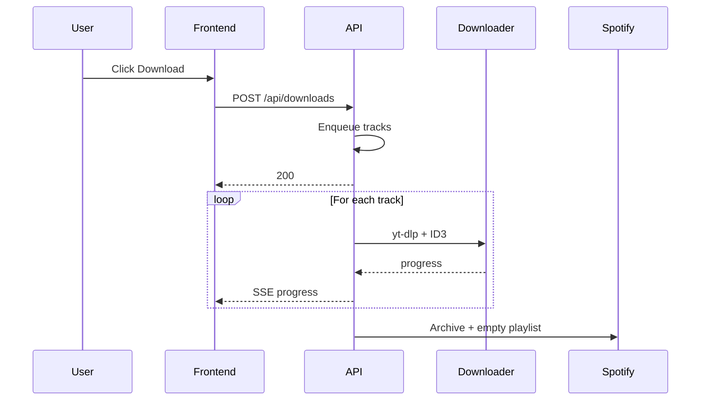
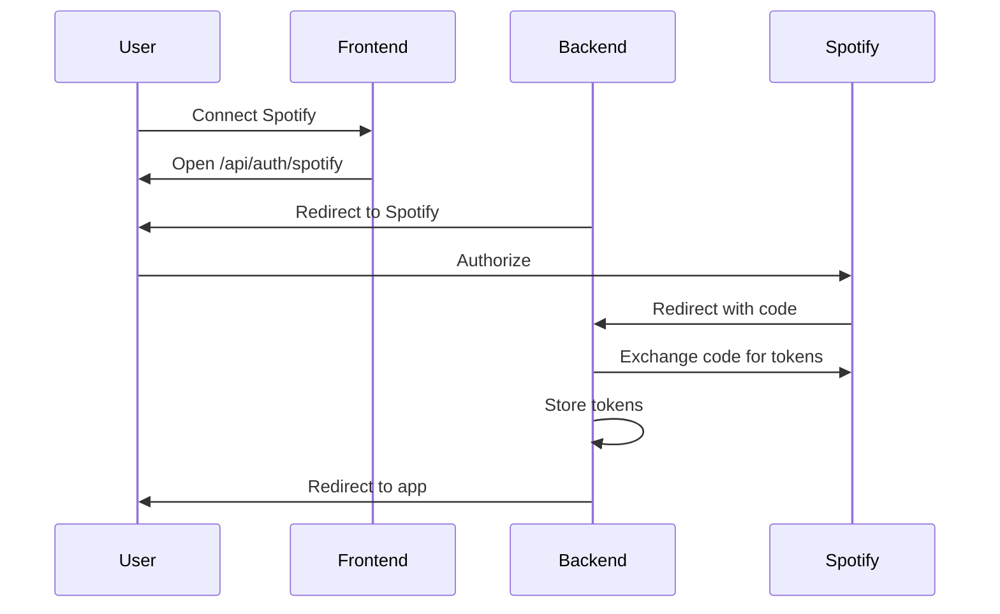

# SpotDownload — Product Documentation

> **Your Spotify playlists, downloaded and synced. Automatically.**

---

## What is SpotDownload?

SpotDownload is a self-hosted, real-time playlist management tool that bridges the gap between Spotify and your local music library. Paste any Spotify playlist URL, and SpotDownload will catalog every track, detect when songs are added or removed, and download new music directly to your computer — all without you lifting a finger.

No more manually searching YouTube for each song. No more forgetting which tracks you already grabbed. SpotDownload watches your playlists in the background and keeps your local library in perfect sync with Spotify.

---

## Why It's Impressive

Most playlist downloaders are one-shot CLI tools: you run a command, wait, and hope for the best. SpotDownload is fundamentally different.

**It's a living system.** It doesn't just download once — it *monitors*. A background scheduler periodically polls every playlist you've added, compares the current state against what's stored in the database, identifies exactly which tracks are new, and queues them for download. You add a playlist once and walk away. New songs appear on your hard drive automatically.

**It's real-time.** Every download fires progress updates over Server-Sent Events. The web UI shows a live progress bar — you see each track transition from queued to downloading to complete (or failed) without refreshing. Notifications stream in when the monitor finds changes, even if you weren't the one who triggered the check.

**It's concurrent.** Downloads don't happen one at a time. A semaphore-controlled pool runs up to three parallel downloads, dramatically reducing wait times for large playlists while keeping system resources in check.

**It's self-contained.** The entire stack — FastAPI backend, React frontend, SQLite database — runs locally with zero external infrastructure. No cloud services, no subscriptions, no accounts beyond your existing Spotify API credentials.

---

## How It Works

### 1. Add a Playlist

Paste a Spotify playlist URL into the input bar. SpotDownload extracts the playlist ID, hits the Spotify Web API, and pulls the full track listing — names, artists, albums, durations, artwork, and Spotify URLs. Everything is persisted to a local SQLite database.

### 2. Monitor for Changes

Once added, the playlist is automatically enrolled in background monitoring. An APScheduler job runs at a configurable interval (default: every 30 minutes), fetching the latest state from Spotify and diffing it against the stored snapshot. New tracks are flagged, removed tracks are cleaned up, and the UI is notified via SSE.

### 3. Download Tracks

Hit the download button — for a single track, all new tracks, or the entire playlist. SpotDownload searches YouTube via `yt-dlp` with the query `"Artist - Track Name"`, selects the best audio match, and converts it to a high-quality MP3 file in your chosen download directory. Progress streams to the browser in real time.

### 4. Configure Everything from the UI

Download path, monitor interval — it's all adjustable from a settings modal in the web interface. The app validates paths on the fly, creates directories if needed, and persists preferences to the database so they survive restarts.

---

## Architecture

SpotDownload follows a clean **client-server architecture** with a clear separation of concerns.

```
┌─────────────────────────────────────────────────────────┐
│                     Browser (React)                     │
│                                                         │
│  ┌──────────┐ ┌──────────┐ ┌───────────┐ ┌──────────┐  │
│  │ Playlist │ │  Track   │ │ Download  │ │ Settings │  │
│  │ Monitor  │ │  List    │ │ Progress  │ │  Modal   │  │
│  └────┬─────┘ └────┬─────┘ └─────┬─────┘ └────┬─────┘  │
│       │             │             │             │        │
│       └─────────────┴──────┬──────┴─────────────┘        │
│                            │                             │
│                     API Client + SSE                     │
└────────────────────────────┬─────────────────────────────┘
                             │  HTTP / SSE
┌────────────────────────────┴─────────────────────────────┐
│                   FastAPI Backend                         │
│                                                          │
│  ┌────────────────────── Routers ──────────────────────┐ │
│  │  /playlists   /downloads   /monitor   /settings     │ │
│  └──────┬────────────┬───────────┬───────────┬─────────┘ │
│         │            │           │           │           │
│  ┌──────┴────────────┴───────────┴───────────┴─────────┐ │
│  │                   Services Layer                     │ │
│  │                                                      │ │
│  │  SpotifyService   DownloadService   MonitorService   │ │
│  │  (spotipy)        (yt-dlp)          (APScheduler)    │ │
│  └──────────────────────┬───────────────────────────────┘ │
│                         │                                 │
│  ┌──────────────────────┴───────────────────────────────┐ │
│  │              SQLite via SQLAlchemy ORM                │ │
│  │                                                      │ │
│  │  Playlists  ──<  Tracks     AppSettings              │ │
│  └──────────────────────────────────────────────────────┘ │
└──────────────────────────────────────────────────────────┘
```

### Backend (Python / FastAPI)

The backend is organized into **three layers**:

| Layer | Purpose |
|-------|---------|
| **Routers** | Four REST API modules (`playlists`, `downloads`, `monitor`, `settings`) handle HTTP requests and SSE streams. |
| **Services** | Business logic lives here — Spotify API interactions, YouTube search + audio download, playlist diffing and sync. |
| **Data** | SQLAlchemy ORM models (`Playlist`, `Track`, `AppSetting`) backed by a local SQLite database. |

Key backend design decisions:

- **Async where it matters.** Spotify API calls (which use the synchronous `spotipy` library) are offloaded to a thread pool via `asyncio.to_thread`, keeping the event loop free for concurrent request handling.
- **Eager loading.** Playlist queries use `selectinload` to batch-fetch related tracks in a single query, eliminating N+1 performance traps.
- **Bounded memory.** In-memory stores for download progress and notifications use `collections.deque` with fixed max lengths, so the server stays lean under sustained use.
- **Singleton services.** The Spotify client and monitor service are instantiated once and shared across requests, avoiding redundant authentication and setup.
- **Shared sync logic.** Playlist refresh and change detection share a single `refresh_playlist_tracks` function in `sync_ops.py`, preventing drift between manual refreshes and background monitoring.

### Frontend (React / Vite / TailwindCSS)

The frontend is a single-page application built for speed and responsiveness:

| Component | Role |
|-----------|------|
| `App.jsx` | Orchestrates global state, SSE subscriptions, and inter-component communication. |
| `PlaylistInput` | URL input with validation — only accepts valid Spotify playlist URLs. |
| `PlaylistMonitor` | Grid of monitored playlists with last-checked timestamps and one-click selection. |
| `TrackList` | Full track table with bulk download actions and per-track controls. |
| `TrackRow` | Individual track display with status indicators (new, downloaded, downloading, failed). |
| `DownloadProgress` | Fixed bottom bar with live progress for active, completed, and failed downloads. |
| `SettingsModal` | Configuration overlay for download path and monitor interval, with real-time path validation. |
| `Layout` | Shell with header, connection status indicator, and settings access. |

Key frontend design decisions:

- **Server-Sent Events** for real-time updates. A custom `useSSE` hook manages EventSource connections with automatic retry and cleanup, so the UI always reflects the latest download state.
- **Aggressive memoization.** Every component is wrapped in `React.memo`. Handlers use `useCallback`, derived data uses `useMemo`. This keeps re-renders surgical even when SSE events fire rapidly.
- **Centralized icons.** All SVG icons are defined once in `Icons.jsx` and memoized, eliminating duplicate SVG markup across the codebase.
- **Utility-first styling.** TailwindCSS provides a consistent, modern UI without a single line of custom CSS beyond base setup.

### Communication

| Channel | Direction | Purpose |
|---------|-----------|---------|
| REST API | Client → Server | CRUD operations, triggering downloads, updating settings |
| SSE `/api/downloads/progress` | Server → Client | Real-time download status updates |
| SSE `/api/monitor/notifications` | Server → Client | Playlist change notifications |

### Data flow (sequence)

**Download flow:** User triggers download → API enqueues tracks → background tasks run yt-dlp → ID3 tags applied → progress sent via SSE → optional post-download workflow (archive + empty playlist).



**OAuth flow:** User clicks Connect → redirect to Spotify → user authorizes → callback with code → backend exchanges code for tokens → tokens stored (optionally encrypted) → status returned.



### Database schema (ERD)

- **playlists**: id, spotify_id (unique), name, description, owner, image_url, track_count, spotify_url, is_monitoring, last_checked, created_at, updated_at.
- **tracks**: id, playlist_id (FK), spotify_id, name, artist, album, genre, duration_ms, image_url, spotify_url, added_at, is_new, is_downloaded, updated_at. Unique (playlist_id, spotify_id).
- **app_settings**: key (PK), value. Stores download_path, monitor_interval_minutes, archive_playlist_name, Spotify tokens, etc.

---

## Tech Stack

| Layer | Technology | Why |
|-------|-----------|-----|
| **Backend Framework** | FastAPI | Async-first Python framework with automatic OpenAPI docs, dependency injection, and native SSE support. |
| **Spotify Integration** | spotipy | The de facto Python client for the Spotify Web API. Handles OAuth and pagination transparently. |
| **Audio Downloads** | yt-dlp | The most actively maintained YouTube downloader. Handles search, extraction, and MP3 conversion in a single pipeline. |
| **Background Jobs** | APScheduler | Lightweight, in-process scheduler. No Redis or Celery overhead — perfect for a self-hosted tool. |
| **Database** | SQLite + SQLAlchemy | Zero-config persistent storage with a full ORM. No database server to install or manage. |
| **Real-time Events** | sse-starlette | SSE integration for Starlette/FastAPI. Enables push-based updates without WebSocket complexity. |
| **Frontend Framework** | React 18 | Component-based UI with hooks for state management and side effects. |
| **Build Tool** | Vite | Near-instant dev server startup and optimized production builds via Rollup. |
| **Styling** | TailwindCSS | Utility-first CSS framework for rapid, consistent UI development. |
| **Package Manager** | Bun | Blazing-fast JavaScript package manager and runtime. |

---

## File Structure

```
SpotDownload/
├── .env                          # Spotify API credentials
├── README.md                     # Quick-start guide
├── Documentation.md              # This file
│
├── backend/
│   ├── main.py                   # FastAPI app, CORS, scheduler, lifespan
│   ├── config.py                 # Environment settings (Pydantic)
│   ├── database.py               # SQLAlchemy engine + session factory
│   ├── models.py                 # ORM models: Playlist, Track, AppSetting
│   ├── requirements.txt          # Python dependencies
│   │
│   ├── routers/
│   │   ├── playlists.py          # Add, list, get, delete, refresh playlists
│   │   ├── downloads.py          # Start downloads, SSE progress stream
│   │   ├── monitor.py            # Check playlists, SSE notifications
│   │   └── settings.py           # Get/update settings, validate paths
│   │
│   └── services/
│       ├── spotify.py            # Spotify API wrapper (async + sync)
│       ├── downloader.py         # yt-dlp YouTube search + MP3 download
│       ├── monitor.py            # Background playlist change detection
│       └── sync_ops.py           # Shared playlist sync/diff logic
│
└── frontend/
    ├── index.html                # SPA entry point
    ├── package.json              # Dependencies and scripts
    ├── vite.config.js            # Vite dev server + proxy config
    ├── tailwind.config.js        # Tailwind theme configuration
    ├── postcss.config.js         # PostCSS plugins
    │
    └── src/
        ├── main.jsx              # React DOM mount
        ├── index.css             # Tailwind base imports
        ├── App.jsx               # Root component + global state
        │
        ├── api/
        │   └── client.js         # Centralized HTTP client
        │
        ├── components/
        │   ├── Icons.jsx         # Memoized SVG icon library
        │   ├── Layout.jsx        # Page shell + header
        │   ├── PlaylistInput.jsx # URL input form
        │   ├── PlaylistMonitor.jsx # Playlist grid overview
        │   ├── TrackList.jsx     # Track table + bulk actions
        │   ├── TrackRow.jsx      # Individual track row
        │   ├── DownloadProgress.jsx # Live download status bar
        │   └── SettingsModal.jsx # Settings configuration modal
        │
        ├── hooks/
        │   └── useSSE.js         # EventSource hook with retry
        │
        └── utils/
            └── format.js         # Duration + time formatting
```

---

## Data Model

### Playlist
| Field | Type | Description |
|-------|------|-------------|
| `id` | Integer (PK) | Internal identifier |
| `spotify_id` | String (unique) | Spotify playlist ID |
| `name` | String | Playlist title |
| `description` | Text | Playlist description |
| `owner` | String | Playlist creator |
| `image_url` | String | Cover art URL |
| `track_count` | Integer | Number of tracks |
| `spotify_url` | String | Link to playlist on Spotify |
| `is_monitoring` | Boolean | Whether background checks are enabled |
| `last_checked` | DateTime | Timestamp of last sync |
| `created_at` | DateTime | When the playlist was added |

### Track
| Field | Type | Description |
|-------|------|-------------|
| `id` | Integer (PK) | Internal identifier |
| `playlist_id` | Integer (FK) | Parent playlist |
| `spotify_id` | String | Spotify track ID |
| `name` | String | Track title |
| `artist` | String | Artist name |
| `album` | String | Album name |
| `duration_ms` | Integer | Track length in milliseconds |
| `image_url` | String | Album art URL |
| `spotify_url` | String | Link to track on Spotify |
| `added_at` | DateTime | When the track was first seen |
| `is_new` | Boolean | Flagged as newly detected |
| `is_downloaded` | Boolean | Whether the MP3 has been saved |

### AppSetting
| Field | Type | Description |
|-------|------|-------------|
| `key` | String (PK) | Setting identifier (e.g., `download_path`) |
| `value` | Text | Setting value |

---

## API Endpoints

| Method | Endpoint | Description |
|--------|----------|-------------|
| `POST` | `/api/playlists` | Add a new playlist by Spotify URL |
| `GET` | `/api/playlists` | List all tracked playlists |
| `GET` | `/api/playlists/{id}` | Get playlist details with tracks |
| `DELETE` | `/api/playlists/{id}` | Remove a playlist and its tracks |
| `POST` | `/api/playlists/{id}/refresh` | Re-sync playlist from Spotify |
| `POST` | `/api/downloads/start` | Begin downloading selected tracks |
| `GET` | `/api/downloads/progress` | SSE stream of download progress events |
| `POST` | `/api/monitor/check` | Manually check all playlists for changes |
| `GET` | `/api/monitor/notifications` | SSE stream of change notifications |
| `GET` | `/api/settings` | Retrieve current app settings |
| `PUT` | `/api/settings` | Update app settings |
| `POST` | `/api/settings/validate-path` | Verify a download path is valid and writable |
| `GET` | `/api/health` | Health check + scheduler status |

---

## Getting Started

1. **Clone the repo** and create a `.env` file with your Spotify API credentials:
   ```
   SPOTIFY_CLIENT_ID=your_client_id
   SPOTIFY_CLIENT_SECRET=your_client_secret
   ```

2. **Start the backend:**
   ```bash
   cd backend
   pip install -r requirements.txt
   uvicorn main:app --reload
   ```

3. **Start the frontend:**
   ```bash
   cd frontend
   bun install
   bun run dev
   ```

4. Open `http://localhost:5173`, paste a Spotify playlist URL, and watch the magic happen.

---

*Built with FastAPI, React, yt-dlp, and a healthy obsession with keeping music libraries in sync.*
